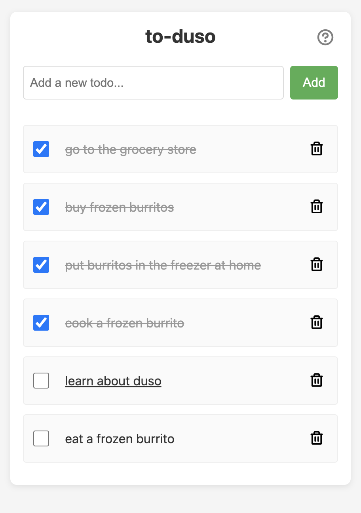

# to-duso

A TODO MVP web app built with Duso, a complete server runtime with zero dependencies and its own full featured web server and flexible nosql database. Uses HTMX for single-page web app interactions. This version is 164 lines of script and html code split into logical route handlers.



## Install Duso

Duso is a server ecosystem built into its own 10MB binary. Visit [duso.rocks/download](https://duso.rocks/download) to download Duso with an instealler, from binaries, or install with Homebrew:

```bash
brew install duso-org/tap/duso
```

## Run the App

```bash
duso server.du
```

Open [http://localhost:8080](http://localhost:8080) to start using the todo app.

## Requirements

- Linux, macOS, or Windows machine with terminal access
- a web browser

## Features

- REST API (create, read, update, delete, and complete todos)
- Sharable url-based multi-session support
- Interactive Web UI (thanks to HTMX)
- Persistent storage

## Tech Stack

- Backend: [Duso](https://duso.rocks)
- Frontend: [HTMX](https://htmx.org)

## File list

| File        | Description                                   |
|-------------|-----------------------------------------------|
| `server.du` | HTTP server setup and route definitions       |
| `index.du`  | Main page with session support and todo list  |
| `render.du` | Shared module to render todos as html         |
| `create.du` | Create a new todo from form submission        |
| `edit.du`   | Show inline edit form for a todo              |
| `update.du` | Save an updated todo                          |
| `delete.du` | Delete a todo                                 |
| `toggle.du` | Toggle todo completion status                 |

## Learn More

- [How it compares](https://duso.rocks/docs/docs/todo-comparison.html) (TL;DR it rocks!)
- [Blog Post](https://balmer.dev) (coming soon)
- [Duso Homepage](https://duso.rocks)
- [HTMX Homepage](https://htmx.org)

## License

[MIT](LICENSE)
